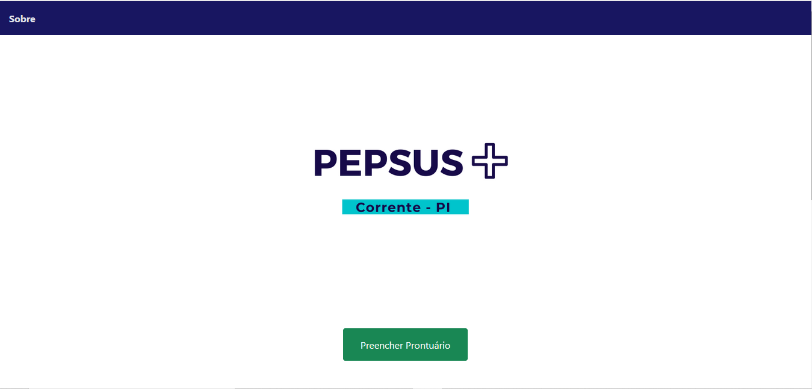

# SISTEMA PEPSUS

## Prontuário Eletrônico do Paciente: 
  Protótipo de um sistema para `Unidade Básica de Saúde (UBS)`. Cadastro a partir de um formulário de dados do paciente, tipo da consulta e os médicos atendentes disponíveis para atendimento nas UBS da cidade. 

  O sistema foi implementado usando a linguagem de programação `Python` de alto nível, interpretada em script, orientada a objetos, de tipagem forte e dinâmica, juntamente com o framework `Django`, que é utilizado para o desenvolvimento web, escrito em Python, utilizando o ```padrão model – template - view```. O uso deste sistema foi efetivado buscando a integração a partir do envio de dados pessoais de pacientes, consultas e médicos através de um formulário para realizar o cadastro em uma UBS. 

  Para a compreensão do sistema, do uso e benefícios no desenvolvimento desse software, buscou-se apresentar a maior facilidade, disponibilidade que o sistema proporciona para os pacientes e profissionais da saúde, diferentemente do atendimento tradicional onde estes precisam do preenchimento de uma ficha em papel todas as vezes que precisam realizar uma consulta. Trata-se do desenvolvimento de um sistema de ```inserção, alteração, busca, exclusão e listagem de um prontuário de pacientes que será salvo no banco de dados para que não corra risco de perda dos dados médicos.```

<h1 align = "center" >

</h1>


<p align="center">

</p>